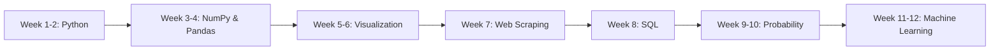

<div align="center">

# 📊 Data Science Learning Journey

### _Master Data Science from Fundamentals to Machine Learning_

    

   

[](https://github.com/ggauravky/Data-Science-Learning) [](https://github.com/ggauravky/Data-Science-Learning/fork) 

[🚀 Get Started](#-quick-start) • [📚 Curriculum](#-curriculum) • [🎯 Projects](#-projects) • [💡 Skills](#-skills-youll-gain) • [🤝 Connect](#-connect)

</div>

---

## 🌟 About This Course

This repository is a **comprehensive, hands-on data science curriculum** designed to take you from absolute beginner to proficient data scientist. With **100+ Jupyter notebooks**, **real-world projects**, and **structured learning paths**, you'll build a strong foundation in:

- ✅ **Python Programming** - Master the language of data science
- ✅ **Data Analysis & Manipulation** - Work with NumPy and Pandas
- ✅ **Data Visualization** - Create stunning charts and insights
- ✅ **Web Scraping** - Collect data from any website
- ✅ **SQL Databases** - Query and manage data efficiently
- ✅ **Statistics & Probability** - Build ML foundations
- ✅ **Machine Learning** - Train your first ML models

**📈 Status:** 🟢 Active & Growing - New content added regularly!

---

## 📚 Curriculum

### 📖 Complete Course Modules

<table>
<tr>
<th width="5%">No.</th>
<th width="25%">Module</th>
<th width="35%">Topics Covered</th>
<th width="15%">Content</th>
<th width="20%">Skills</th>
</tr>

<tr>
<td align="center">01</td>
<td><b>🎓 Data Science Intro</b></td>
<td>Tools, Environment Setup, Career Paths, DS Lifecycle</td>
<td>1 PDF Guide</td>
<td>Foundation setup</td>
</tr>

<tr>
<td align="center">02</td>
<td><b>🐍 Python Fundamentals</b></td>
<td>Variables, Data Types, Operators, Control Flow, Loops, Data Structures, OOP, Lambda</td>
<td>18 Notebooks</td>
<td>Complete Python</td>
</tr>

<tr>
<td align="center">03</td>
<td><b>🚀 Project: Social Network</b></td>
<td>Recommendation Algorithms, Graph Theory, JSON Processing</td>
<td>3 Notebooks</td>
<td>Real-world application</td>
</tr>

<tr>
<td align="center">04</td>
<td><b>🔢 NumPy Mastery</b></td>
<td>Arrays, Indexing, Slicing, Broadcasting, Vectorization</td>
<td>5 Notebooks</td>
<td>Numerical computing</td>
</tr>

<tr>
<td align="center">05</td>
<td><b>🐼 Pandas Deep Dive</b></td>
<td>DataFrames, Series, Grouping, Merging, Time Series</td>
<td>2 Notebooks</td>
<td>Data manipulation</td>
</tr>

<tr>
<td align="center">06</td>
<td><b>📊 Data Visualization</b></td>
<td>Line, Bar, Pie, Scatter, Histogram, Heatmaps, Seaborn</td>
<td>8 Notebooks</td>
<td>Visual storytelling</td>
</tr>

<tr>
<td align="center">07</td>
<td><b>🕷️ Web Scraping</b></td>
<td>HTTP Requests, HTML Parsing, BeautifulSoup, Data Extraction</td>
<td>2 Notebooks + 49 HTML samples</td>
<td>Web data collection</td>
</tr>

<tr>
<td align="center">08</td>
<td><b>🗄️ SQL & Databases</b></td>
<td>CRUD Operations, Joins, Subqueries, Views, Stored Procedures</td>
<td>20 Tutorials</td>
<td>Database management</td>
</tr>

<tr>
<td align="center">09</td>
<td><b>📈 Probability & Stats</b></td>
<td>Conditional Probability, Bayes Theorem, Distributions</td>
<td>3 Tutorials + Practice</td>
<td>Statistical thinking</td>
</tr>

<tr>
<td align="center">10</td>
<td><b>🤖 ML Introduction</b></td>
<td>How Machines Learn, ML History, Traditional vs ML</td>
<td>PPT + Notes</td>
<td>ML fundamentals</td>
</tr>

<tr>
<td align="center">11</td>
<td><b>🔧 Sklearn Basics</b></td>
<td>First ML Models, Training, Prediction, Model Selection</td>
<td>3 Notebooks</td>
<td>Scikit-learn</td>
</tr>

<tr>
<td align="center">12</td>
<td><b>📋 ML Algorithm Types</b></td>
<td>Supervised vs Unsupervised Learning, Use Cases</td>
<td>3 Guides</td>
<td>Algorithm selection</td>
</tr>

<tr>
<td align="center">13</td>
<td><b>🎯 ML Practice</b></td>
<td>Iris Classification, Model Evaluation, RMSE, MAE, Test Sets</td>
<td>5+ Notebooks</td>
<td>End-to-end ML</td>
</tr>

</table>

---

## 🚀 Quick Start

### Prerequisites

- 💻 Basic computer skills
- 🧠 Curiosity and willingness to learn
- ⏰ 8-10 hours per week commitment
- ❌ **No prior programming experience needed!**

### Installation

**Step 1:** Clone the repository

```bash
git clone https://github.com/ggauravky/Data-Science-Learning.git
cd Data-Science-Learning
```

**Step 2:** Set up Python environment

```bash
# Option A: Using Conda (Recommended)
conda create -n datasci python=3.11 -y
conda activate datasci
conda install numpy pandas matplotlib seaborn jupyter scikit-learn -y
pip install beautifulsoup4 requests

# Option B: Using pip
pip install numpy pandas matplotlib seaborn jupyter beautifulsoup4 requests scikit-learn
```

**Step 3:** Launch Jupyter

```bash
jupyter notebook
```

**Step 4:** Start learning! 🎉

Navigate to `002 Python refresher/01_python_basic.ipynb` and begin your journey!

---

## 📖 Learning Path

### 🎯 Recommended 12-Week Roadmap



<details>
<summary><b>📅 Week-by-Week Breakdown (Click to expand)</b></summary>

### 🌱 Phase 1: Foundation (Weeks 1-4)

**Week 1-2: Python Programming**

- Complete all 18 Python notebooks
- Focus: Variables, loops, functions, OOP
- Practice: Daily coding exercises
- Milestone: Build a simple calculator app

**Week 3: NumPy**

- Master array operations
- Learn vectorization techniques
- Practice: Matrix manipulations

**Week 4: Pandas & First Project**

- DataFrame operations
- Data cleaning techniques
- **Project:** Coders of Delhi recommendation system

### 🌿 Phase 2: Intermediate (Weeks 5-8)

**Week 5-6: Data Visualization**

- All chart types in Matplotlib
- Statistical plots with Seaborn
- Practice: Visualize real datasets

**Week 7: Web Scraping**

- HTTP requests and responses
- HTML parsing with BeautifulSoup
- **Project:** Book scraper

**Week 8: SQL Databases**

- CRUD operations
- Complex joins and queries
- Practice: Build a movie database

### 🌳 Phase 3: Advanced (Weeks 9-12)

**Week 9-10: Statistics & SQL Advanced**

- Probability distributions
- Bayes theorem applications
- Stored procedures and optimization

**Week 11-12: Machine Learning**

- ML fundamentals
- First models with Scikit-learn
- **Project:** Iris classification
- Model evaluation and metrics

</details>

---

## 🎯 Projects

### Featured Real-World Projects

<table>
<tr>
<td width="50%">

#### 🌐 Coders of Delhi

**Social Network Recommendation System**

Build algorithms similar to Facebook's "People You May Know" feature.

**Tech Stack:** Python, JSON, Graph Algorithms  
**Complexity:** Intermediate  
**Skills:** Data structures, algorithms, recommendation engines

**Files:**

- `data_read.ipynb`
- `people_you_may_know.ipynb`
- `pages_you_might_like.ipynb`

</td>
<td width="50%">

#### 📚 Book Data Scraper

**Web Scraping Pipeline**

Scrape 49 pages of book data from an online bookstore.

**Tech Stack:** Requests, BeautifulSoup, Pandas  
**Complexity:** Beginner-Intermediate  
**Skills:** HTTP, HTML parsing, data extraction

**Output:** Structured CSV with titles, prices, ratings

</td>
</tr>
<tr>
<td width="50%">

#### 🌸 Iris Classification

**Machine Learning Project**

Train and evaluate ML models on the classic Iris dataset.

**Tech Stack:** Scikit-learn, NumPy, Pandas  
**Complexity:** Intermediate  
**Skills:** Model training, evaluation, accuracy metrics

**Notebooks:**

- Quick training
- Accuracy measurement
- Data analysis
- Test set creation
- Stratified sampling

</td>
<td width="50%">

#### 📊 Data Analysis Suite

**Pandas Practice Projects**

Analyze real-world datasets with advanced techniques.

**Tech Stack:** Pandas, Matplotlib, Seaborn  
**Complexity:** Beginner-Intermediate  
**Skills:** Grouping, merging, aggregation, visualization

**Features:**

- Data cleaning pipelines
- Statistical analysis
- Trend visualization

</td>
</tr>
</table>

---

## 💡 Skills You'll Gain

<table>
<tr>
<td width="33%">

### 🐍 Programming

- ✅ Python syntax & semantics
- ✅ Object-oriented programming
- ✅ Functional programming
- ✅ List comprehensions
- ✅ Lambda expressions
- ✅ File I/O operations
- ✅ JSON data handling
- ✅ Error handling

</td>
<td width="33%">

### 📊 Data Science

- ✅ NumPy array operations
- ✅ Pandas DataFrames
- ✅ Data cleaning & preprocessing
- ✅ Statistical analysis
- ✅ Data visualization
- ✅ Exploratory data analysis
- ✅ Feature engineering
- ✅ Data transformation

</td>
<td width="33%">

### 🤖 Machine Learning

- ✅ ML fundamentals
- ✅ Supervised learning
- ✅ Unsupervised learning
- ✅ Model training
- ✅ Model evaluation
- ✅ Scikit-learn library
- ✅ Algorithm selection
- ✅ Performance metrics

</td>
</tr>
<tr>
<td width="33%">

### 🗄️ Databases

- ✅ SQL queries (SELECT, JOIN)
- ✅ Database design
- ✅ CRUD operations
- ✅ Aggregations & grouping
- ✅ Subqueries
- ✅ Views & indexes
- ✅ Stored procedures
- ✅ Query optimization

</td>
<td width="33%">

### 🕷️ Web Scraping

- ✅ HTTP protocol
- ✅ HTML structure
- ✅ CSS selectors
- ✅ BeautifulSoup parsing
- ✅ Requests library
- ✅ Data extraction
- ✅ Ethical scraping
- ✅ Pipeline building

</td>
<td width="33%">

### 📈 Statistics

- ✅ Probability theory
- ✅ Distributions
- ✅ Conditional probability
- ✅ Bayes theorem
- ✅ Hypothesis testing
- ✅ Statistical inference
- ✅ Sampling techniques
- ✅ Error metrics

</td>
</tr>
</table>

---

## 🛠️ Technology Stack

<div align="center">

### Core Technologies

| Category                | Tools                     |
| ----------------------- | ------------------------- |
| **💻 Language**         | Python 3.11+              |
| **📊 Data Analysis**    | NumPy, Pandas             |
| **📈 Visualization**    | Matplotlib, Seaborn       |
| **🕸️ Web Scraping**     | Requests, BeautifulSoup4  |
| **🗄️ Database**         | MySQL                     |
| **🤖 Machine Learning** | Scikit-learn              |
| **📓 IDE**              | Jupyter Notebook, VS Code |

</div>

---

## 📈 Progress Tracker

Use this checklist to track your learning journey:

### Core Modules

- [ ] 🎓 Introduction to Data Science
- [ ] 🐍 Python Fundamentals (18 notebooks)
- [ ] 🔢 NumPy Mastery (5 notebooks)
- [ ] 🐼 Pandas Deep Dive (2 notebooks)
- [ ] 📊 Data Visualization (8 notebooks)
- [ ] 🕷️ Web Scraping (2 notebooks)
- [ ] 🗄️ SQL & Databases (20 tutorials)
- [ ] 📈 Probability & Statistics
- [ ] 🤖 Machine Learning Introduction
- [ ] 🔧 Scikit-learn Basics
- [ ] 📋 ML Algorithm Types
- [ ] 🎯 ML Practice (5+ notebooks)

### Projects

- [ ] 🌐 Coders of Delhi - Social Network
- [ ] 📚 Book Data Scraper
- [ ] 🌸 Iris Classification
- [ ] 📊 Data Analysis Projects

### Milestones

- [ ] 🎖️ Completed first 50 notebooks
- [ ] 🏆 Built 3 portfolio projects
- [ ] 🚀 Trained first ML model
- [ ] ⭐ Contributed to the repo

---

## 🤝 Connect

<div align="center">

### Let's Learn Together!

[](https://www.linkedin.com/in/gauravky/) [](https://github.com/ggauravky) [](https://www.instagram.com/the_gau_rav/)

**Questions? Suggestions? Want to collaborate?**  
Feel free to open an issue or reach out directly!

</div>

---

## 🤝 Contributing

We welcome contributions from the community! Here's how you can help:

### Ways to Contribute

- 🐛 **Report Bugs:** Found an error? Let us know!
- 💡 **Suggest Features:** Have ideas for new content?
- 📝 **Improve Documentation:** Help make explanations clearer
- 🎨 **Add Examples:** Share your own projects and solutions
- 🌐 **Translate:** Help make content accessible in other languages

### How to Contribute

1. **Fork** this repository
2. **Create** a feature branch (`git checkout -b feature/AmazingFeature`)
3. **Commit** your changes (`git commit -m 'Add some AmazingFeature'`)
4. **Push** to the branch (`git push origin feature/AmazingFeature`)
5. **Open** a Pull Request

---

## 📜 License

This project is licensed under the **MIT License** - see the [LICENSE](LICENSE) file for details.

**TL;DR:** You can use, modify, and distribute this content freely. Attribution appreciated! 🙏

---

## ⭐ Show Your Support

If this repository helped you in your data science journey:

- ⭐ **Star** this repository
- 🍴 **Fork** it for your own learning
- 📢 **Share** with fellow learners
- 💬 **Spread** the word on social media

<div align="center">

### 📊 Repository Stats


</div>

---

## 🙏 Acknowledgments

- 🎓 Inspired by various data science courses and bootcamps
- 📚 Built with passion for the data science community
- 🌟 Thanks to all contributors and learners

---

<div align="center">

### Made with ❤️ for Data Science Learners Worldwide

**Happy Learning! 🚀**


</div>
